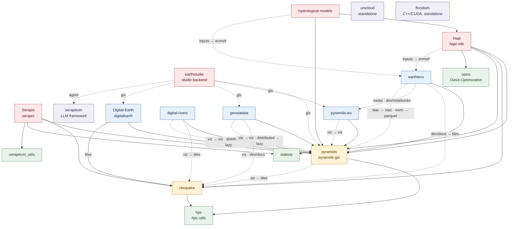

# Package dependency graph

How the Serapeum Python packages depend on each other. Arrows read **"depends on"** — a package points at what it
needs, so the foundation layers sit at the bottom and the applications at the top.

Labels name the extra on **both** ends of a link:

- **Solid arrows** are required dependencies (`project.dependencies`). A label is the extra the dependency is
  installed with — `digital_earth -->|tiles| cleopatra` means `digitalearth` requires `cleopatra[tiles]`.
- **Dashed arrows** are optional. The label reads `<extra on this package> → <extra requested on the dependency>`,
  and the right-hand side is dropped when the dependency is requested plain. So `hapi -.->|inputs → ecmwf|
  earthlens` means `pip install hapi-nile[inputs]` brings in `earthlens[ecmwf]`.
- A dashed arrow **alongside** a solid one is an extra that *upgrades* a dependency you already have:
  `digital-rivers` always needs `pyramids-gis`, and `digital-rivers[distributed]` swaps it for `pyramids-gis[lazy]`.
- `dev`, `docs` and `notebooks` are PEP 735 dependency groups, not user-installable extras — they affect
  contributors, not consumers. `·` separates several extras that produce the same link.

## The layers

| Layer | Packages | Role |
|---|---|---|
| Foundation | `hpc-utils`, `statista`, `Oasis-Optimization`, `serapeum_utils` | Numeric, statistical and optimization primitives with no intra-stack dependencies |
| Engine | `pyramids-gis`, `cleopatra` | The GDAL/OGR layer and the matplotlib layer everything else builds on |
| Domain libraries | `pyramids-eo`, `digital-rivers`, `geostatista`, `digitalearth`, `earthlens` | Specialized capabilities on top of the engine — EO, DEM, geostatistics, visualization, data acquisition |
| Applications | `hapi-nile`, `serapis`, `hydrological-models`, `earthstudio` | End-user models and services |

## Notes

**`cleopatra` is an optional dependency of the engine.** `pyramids-gis`, `digital-rivers` and `geostatista` all
reach it through a `viz` extra rather than a required dependency, so a bare install of any of them pulls no
plotting stack. The convention that plotting goes through `cleopatra` is still binding — it is enforced by code
review, not by the dependency metadata.

**Each layer owns its concern.** `digital-rivers` is the source of truth for DEM processing, `pyramids-gis` for
GIS, and `cleopatra` for matplotlib. Downstream packages are expected to depend upward rather than reimplement a
capability that already has a home.

**`pyramids-eo` never declares GDAL.** `pyramids-gis` vendors it; declaring it again would force a from-source
build on platforms with no wheel.

**Three packages sit outside the graph.** `unicloud` has no edges in either direction. `floodsim` is a C++/CUDA
engine with no Python dependencies. `serapeum` (the LLM framework) depends on nothing in the stack, and is reached
only through `earthstudio`'s `agent` extra.
